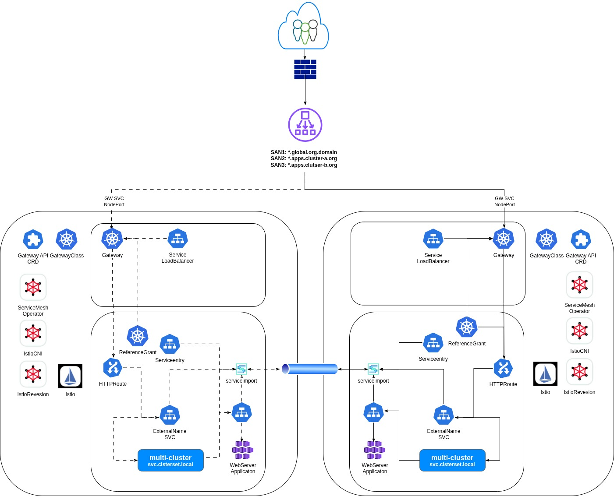

# Multi-Cloud-Full-Mesh

General
-------
In today’s dynamic IT landscape, the ability to ensure application resiliency across diverse environments is no longer a luxury—it's a foundational requirement. As organizations increasingly adopt hybrid and multi-cloud strategies, they need robust solutions that abstract away the complexities of the underlying infrastructure, whether on-premises, in the public cloud, or at the edge. Red Hat is at the forefront of this evolution, delivering innovative approaches that leverage powerful open source technologies like Submariner, Red Hat OpenShift Service Mesh, and modern API management tools to pave a clear pathway towards comprehensive, full-mesh resiliency for your critical applications.

Instructions
------------
This repo containes the manifests that are required to deploy a Multi-Cloud Full-Mesh solution as it is described on the Red Hat blog: <https://docs.google.com/document/d/1aYqIraG3TF0BM7wUg5IEQBIsDWciYLd0gDy5tQGXT2g/edit?tab=t.0#heading=h.bges0t6y0oi1>

Please refer to the instructions in each deployment.

Architecture
------------

Docs
------------
1. Service-Mesh - https://docs.redhat.com/en/documentation/openshift_container_platform/4.19/html-single/service_mesh/index#ossm-custom-resources-v1x
2. Gateway API - https://gateway-api.sigs.k8s.io/concepts/glossary/#gateway-controller
3. Submariner Community - https://submariner.io/getting-started/architecture/service-discovery
4. Submariner Official - https://docs.redhat.com/en/documentation/red_hat_advanced_cluster_management_for_kubernetes/2.13/html-single/networking/index#subm-vpc-config
5. Multi-Cluster - https://github.com/kubernetes/enhancements/tree/master/keps/sig-multicluster/1645-multi-cluster-services-api
